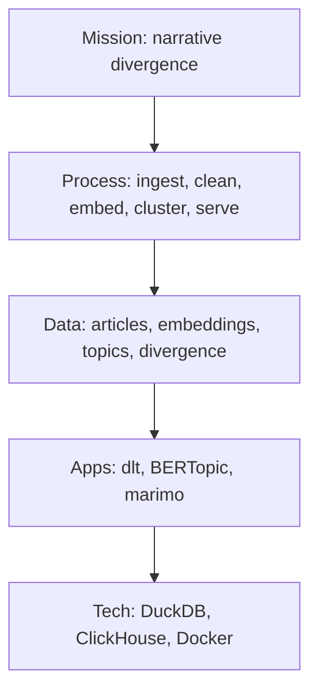

# 01. EA Hierarchy

> Stub. Jack to flesh out in Week 1.

Maps the course's EA hierarchy (mission to process to data to application to technology) to this project.

| Layer | This project |
|-------|--------------|
| Mission | Surface narrative divergence in cross-country news coverage. |
| Process | Ingest → clean → embed → cluster → serve. |
| Data | Article corpus (5 countries, 6 weeks rolling), embeddings, topic clusters, divergence scores. |
| Application | dlt pipelines (ingestion), BERTopic (clustering), marimo (dashboard). |
| Technology | DuckDB (raw lake), ClickHouse (DWH), Docker (local infra), GitHub (collaboration). |

Mermaid diagram:

