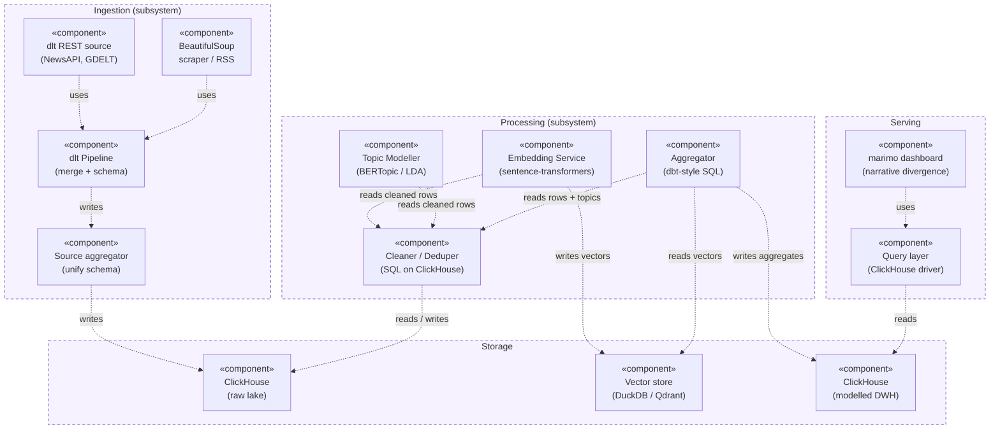
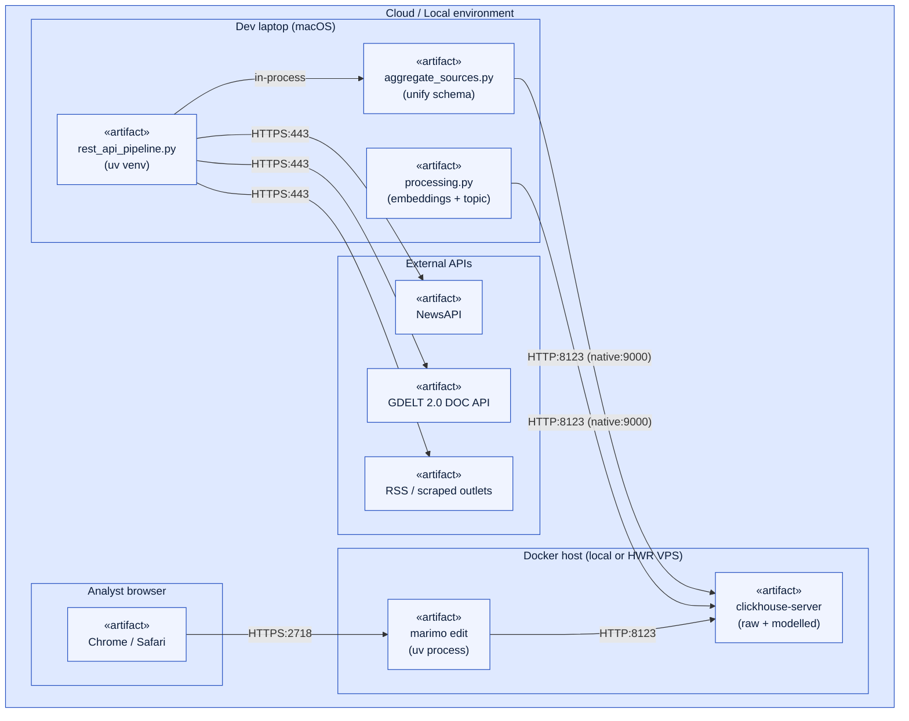

# System Design Diagrams

## 1. Data Flow Diagram (Level 1)

```mermaid
flowchart LR
    %% External entities (rectangles)
    SRC[/"News APIs<br/>NewsAPI, GDELT"/]
    RSS[/"RSS + Scraped sites<br/>DE, US, IT, MM, KZ"/]
    ANL[/"Analyst<br/>(dashboard user)"/]

    %% Processes (rounded)
    P1(["P1<br/>Ingest &amp; Validate<br/>(dlt + BS4)"])
    P1B(["P1.5<br/>Aggregate sources<br/>(unify schema)"])
    P2(["P2<br/>Clean &amp; Dedup"])
    P3(["P3<br/>Embed &amp; Topic-Model"])
    P4(["P4<br/>Aggregate<br/>country x topic x time"])
    P5(["P5<br/>Serve Query API"])

    %% Data stores
    DS1[("DS1<br/>ClickHouse<br/>raw lake")]
    DS2[("DS2<br/>Vector store<br/>embeddings")]
    DS3[("DS3<br/>ClickHouse<br/>modelled DWH")]

    SRC -- "raw articles (JSON)" --> P1
    RSS -- "HTML + RSS items" --> P1
    P1  -- "validated rows" --> P1B
    P1B -- "unified rows" --> DS1
    DS1 -- "raw rows" --> P2
    P2  -- "cleaned, deduped rows" --> P3
    P3  -- "vectors + topic IDs" --> DS2
    P3  -- "enriched rows" --> P4
    DS2 -- "neighbour vectors" --> P4
    P4  -- "country_topic_daily, divergence" --> DS3
    DS3 -- "aggregates" --> P5
    P5  -- "narrative divergence views" --> ANL

    classDef ext fill:#ffe4d2,stroke:#d96f3a,color:#3a1f0c;
    classDef proc fill:#f2e9ff,stroke:#7b4fbf,color:#1d0c3a;
    classDef store fill:#dfe9ff,stroke:#1f4cbf,color:#0c1d3a;
    class SRC,RSS,ANL ext;
    class P1,P1B,P2,P3,P4,P5 proc;
    class DS1,DS2,DS3 store;
```

## 2. Component Diagram (UML)

```mermaid
flowchart TB
    subgraph ING ["Ingestion (subsystem)"]
        direction TB
        DLTSRC["«component»<br/>dlt REST source<br/>(NewsAPI, GDELT)"]
        BS4["«component»<br/>BeautifulSoup<br/>scraper / RSS"]
        DLTPIPE["«component»<br/>dlt Pipeline<br/>(merge + schema)"]
        SRCAGG["«component»<br/>Source aggregator<br/>(unify schema)"]
    end

    subgraph PROC ["Processing (subsystem)"]
        direction TB
        CLEAN["«component»<br/>Cleaner / Deduper<br/>(SQL on ClickHouse)"]
        EMB["«component»<br/>Embedding Service<br/>(sentence-transformers)"]
        TOPIC["«component»<br/>Topic Modeller<br/>(BERTopic / LDA)"]
        AGG["«component»<br/>Aggregator<br/>(dbt-style SQL)"]
    end

    subgraph STORE ["Storage"]
        direction TB
        CH_RAW["«component»<br/>ClickHouse<br/>(raw lake)"]
        VEC["«component»<br/>Vector store<br/>(DuckDB / Qdrant)"]
        CH["«component»<br/>ClickHouse<br/>(modelled DWH)"]
    end

    subgraph SERVE ["Serving"]
        direction TB
        MARIMO["«component»<br/>marimo dashboard<br/>(narrative divergence)"]
        QAPI["«component»<br/>Query layer<br/>(ClickHouse driver)"]
    end

    DLTSRC -. "uses" .-> DLTPIPE
    BS4    -. "uses" .-> DLTPIPE
    DLTPIPE -. "writes" .-> SRCAGG
    SRCAGG  -. "writes" .-> CH_RAW

    CLEAN -. "reads / writes" .-> CH_RAW
    EMB   -. "reads cleaned rows" .-> CLEAN
    EMB   -. "writes vectors" .-> VEC
    TOPIC -. "reads cleaned rows" .-> CLEAN
    AGG   -. "reads rows + topics" .-> CLEAN
    AGG   -. "reads vectors" .-> VEC
    AGG   -. "writes aggregates" .-> CH

    MARIMO -. "uses" .-> QAPI
    QAPI   -. "reads" .-> CH

    classDef sub fill:#f7f2ff,stroke:#7b4fbf,stroke-dasharray: 5 4;
    class ING,PROC,STORE,SERVE sub;
```

## 3. Deployment Diagram (UML)

```mermaid
flowchart LR
    subgraph ENV ["Cloud / Local environment"]
        direction LR

        subgraph DEV ["Dev laptop (macOS)"]
            direction TB
            ART_PIPE["«artifact»<br/>rest_api_pipeline.py<br/>(uv venv)"]
            ART_AGG["«artifact»<br/>aggregate_sources.py<br/>(unify schema)"]
            ART_PROC["«artifact»<br/>processing.py<br/>(embeddings + topic)"]
        end

        subgraph DOCKER ["Docker host (local or HWR VPS)"]
            direction TB
            ART_CH["«artifact»<br/>clickhouse-server<br/>(raw + modelled)"]
            ART_MARIMO["«artifact»<br/>marimo edit<br/>(uv process)"]
        end

        subgraph EXTAPI ["External APIs"]
            direction TB
            ART_NEWS["«artifact»<br/>NewsAPI"]
            ART_GDELT["«artifact»<br/>GDELT 2.0 DOC API"]
            ART_RSS["«artifact»<br/>RSS / scraped outlets"]
        end

        subgraph CLIENT ["Analyst browser"]
            ART_BROWSER["«artifact»<br/>Chrome / Safari"]
        end
    end

    ART_PIPE -- "HTTPS:443" --> ART_NEWS
    ART_PIPE -- "HTTPS:443" --> ART_GDELT
    ART_PIPE -- "HTTPS:443" --> ART_RSS
    ART_PIPE -- "in-process" --> ART_AGG
    ART_AGG  -- "HTTP:8123 (native:9000)" --> ART_CH
    ART_PROC -- "HTTP:8123 (native:9000)" --> ART_CH
    ART_MARIMO -- "HTTP:8123" --> ART_CH
    ART_BROWSER -- "HTTPS:2718" --> ART_MARIMO

    classDef node fill:#dfe9ff,stroke:#1f4cbf,color:#0c1d3a;
    classDef art fill:#f0f4ff,stroke:#1f4cbf,color:#0c1d3a;
    class DEV,DOCKER,EXTAPI,CLIENT,ENV node;
    class ART_PIPE,ART_AGG,ART_PROC,ART_CH,ART_MARIMO,ART_NEWS,ART_GDELT,ART_RSS,ART_BROWSER art;
```
