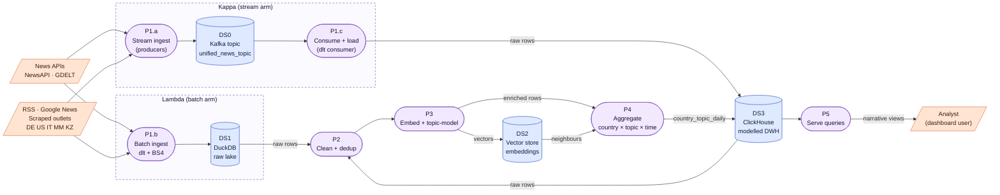
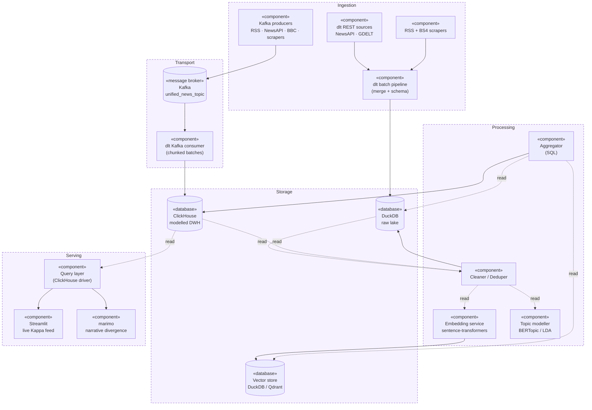
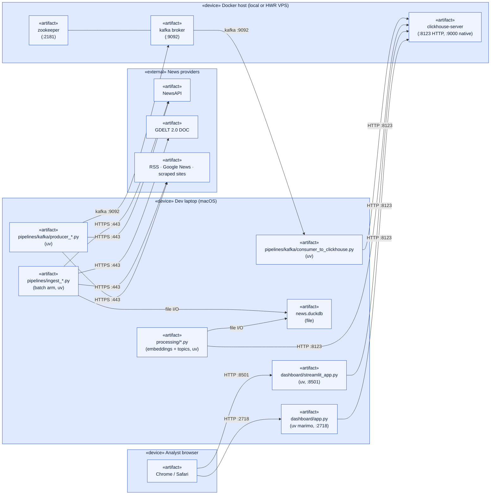

# System Design Diagrams

Three views of the platform: data flow, components, deployment. Diagrams use Mermaid so they render inline on GitHub and in the report.

## 1. Data Flow Diagram (Level 1)

Two ingestion paths flow into one warehouse: a **Lambda batch arm** (top) for outlets that only expose batch APIs and a **Kappa stream arm** (bottom) that publishes through Kafka. Downstream cleaning, embedding, topic modelling, and aggregation are shared.

## 2. Component Diagram (UML)

Components are stacked top to bottom along the data lifecycle: ingest, transport, process, store, serve. Solid arrows are "uses" / "writes to"; dashed are read paths.

## 3. Deployment Diagram (UML)

Three nodes: the dev laptop (Python processes), a Docker host (broker + DWH), and external APIs. Dashboards run as `uv` processes on the dev laptop, not inside containers.

## Reading guide

- **DFD (1)** answers "what data goes where" without committing to technology. The Kappa and Lambda subgraphs are the two ingestion shapes the project runs in parallel.
- **Component (2)** answers "what software is involved" and groups by lifecycle stage. Kafka sits in a dedicated transport layer to make the decoupling between producers and consumer explicit.
- **Deployment (3)** answers "where does this run" and how the boxes talk over the wire. Local dev shape: most processes are `uv` on the laptop; only the broker + DWH live in Docker.
